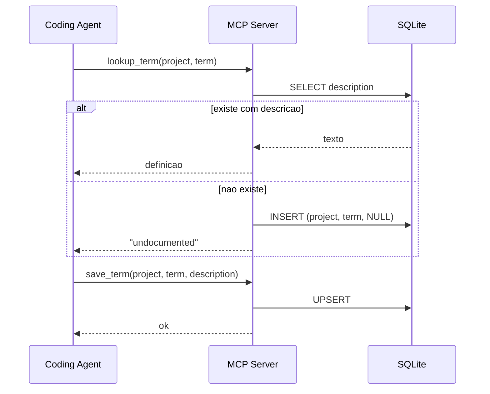

# Design - Domain Glossary MCP

## Decisoes tecnicas

### Runtime SQLite: `node:sqlite`

O modulo `node:sqlite` e built-in no Node desde a 22.5. Corre sem flag desde a
22.13 e e release candidate desde a 25.7. A alternativa, `better-sqlite3`, e um
addon nativo e falha o install em ambientes de CI sem prebuild. Usamos
`DatabaseSync`.

### Validacao leve em vez de allowlist

Uma allowlist mantida a mao desincroniza do codigo em poucas semanas. Em vez
disso o servidor aplica regras simples:

- `trim()` em todos os campos
- rejeita vazio ou so whitespace
- rejeita sufixos `DTO`, `Request`, `Response`, `Mapper`, `Config`
- normaliza para comparacao case-insensitive, mas guarda a grafia original

### Resolucao do path do DB

1. O argumento `--db <path>`, que vive no array `args` do config do cliente MCP
2. `GLOSSARY_DB_PATH`, que vive no bloco `env` do mesmo config
3. `env-paths('domain-glossary').data/glossary.db`, o glossario global

O argumento ganha da variavel. A escolha do ficheiro fica visivel ao lado do
comando, num unico lugar do config. A variavel serve quando um script wrapper
ou um job de CI fornece o path.

O servidor expande um `~` inicial e torna um path relativo absoluto, porque um
config JSON nao passa pela shell. A linha de log de arranque reporta o `dbPath`
e o `dbPathSource` (`argument`, `environment` ou `default`).

Isto torna a escolha entre um glossario por repo e um glossario central uma
decisao de config, nao de codigo.

O servidor cria o diretorio se nao existir e ativa WAL mode. O ficheiro nunca
vive dentro de `node_modules`, porque o npm apaga esse conteudo em cada
reinstalacao.

Localizacoes do `env-paths`:

| SO | Path |
|---|---|
| macOS | `~/Library/Application Support/domain-glossary-nodejs/` |
| Linux | `$XDG_DATA_HOME/domain-glossary-nodejs/` ou `~/.local/share/domain-glossary-nodejs/` |
| Windows | `%LOCALAPPDATA%\domain-glossary-nodejs\Data\` |

## Schema

```sql
CREATE TABLE IF NOT EXISTS glossary (
  project     TEXT NOT NULL,
  term        TEXT NOT NULL,
  description TEXT,
  updated_at  TEXT NOT NULL DEFAULT (datetime('now')),
  PRIMARY KEY (project, term)
) STRICT;
```

A coluna `description` aceita NULL. Esse NULL marca a lacuna.

Para a comparacao case-insensitive, as colunas de chave usam
`COLLATE NOCASE`, o que faz a primary key tratar `Order` e `order` como a
mesma entry.

## Tools

| Tool | Input | Output |
|---|---|---|
| `lookup_term` | `project`, `term` | descricao, ou "undocumented" e cria a entry NULL |
| `save_term` | `project`, `term`, `description` | confirmacao do upsert |
| `list_missing_terms` | `project` (opcional) | termos com `description IS NULL` |

## Fluxo



## Estrutura de ficheiros

```
src/
  index.ts       bin entry, liga o servidor ao transporte stdio
  server.ts      cria o McpServer e registra os 3 tools
  db.ts          resolve o path, abre a conexao, aplica o schema
  glossary.ts    lookupTerm, saveTerm, listMissingTerms
  validation.ts  normalizacao e regras de rejeicao
  logger.ts      log estruturado em stderr
test/
  db.test.ts
  glossary.test.ts
  validation.test.ts
  server.test.ts
```

A camada `glossary.ts` recebe a conexao por parametro. Isso mantem os testes
sem estado global e permite um DB temporario por teste.
