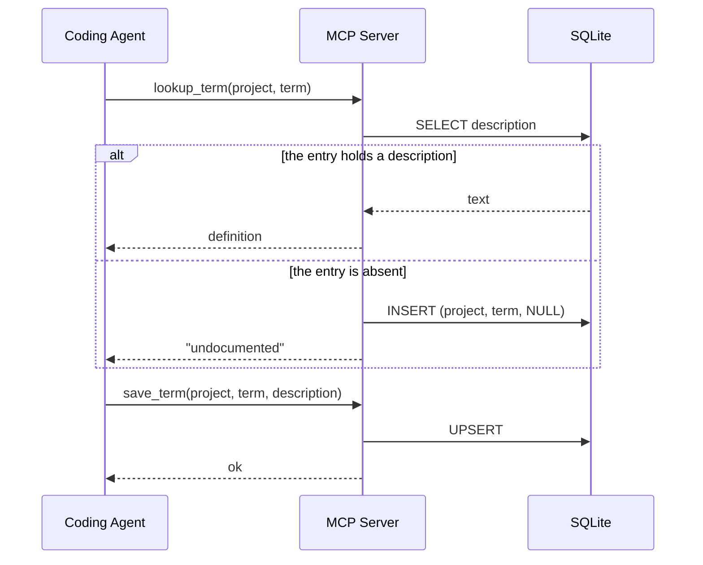

# Design - Domain Glossary MCP

## Technical decisions

### SQLite runtime: `node:sqlite`

The `node:sqlite` module is built into Node since version 22.5. It runs without
a flag since 22.13, and it is a release candidate since 25.7. The alternative,
`better-sqlite3`, is a native addon and fails the install in a CI environment
without a prebuild. The server uses `DatabaseSync`.

### Light validation instead of an allowlist

An allowlist kept by hand goes out of sync with the code in a few weeks. The
server applies simple rules instead:

- `trim()` on every field
- reject a value that is empty or that holds only whitespace
- reject the suffixes `DTO`, `Request`, `Response`, `Mapper`, `Config`
- compare without regard to letter case, but keep the original spelling

### Database path resolution

1. The `--db <path>` argument, which lives in the `args` array of the MCP client
   config
2. `GLOSSARY_DB_PATH`, which lives in the `env` block of the same config
3. `env-paths('domain-glossary').data/glossary.db`, the global glossary

The argument wins over the variable. The choice of file sits next to the
command, in one place of the config. The variable serves a wrapper script or a
CI job that supplies the path.

The server expands a leading `~` and turns a relative path into an absolute
one, because a JSON config does not pass through a shell. The startup log line
reports `dbPath` and `dbPathSource`, which holds `argument`, `environment` or
`default`.

A per-repository glossary and a shared one are therefore a config choice, not a
code change.

The server creates the directory when it is absent and enables WAL mode. The
file never lives inside `node_modules`, because npm deletes that content on
each reinstall.

`env-paths` locations:

| OS | Path |
|---|---|
| macOS | `~/Library/Application Support/domain-glossary-nodejs/` |
| Linux | `$XDG_DATA_HOME/domain-glossary-nodejs/` or `~/.local/share/domain-glossary-nodejs/` |
| Windows | `%LOCALAPPDATA%\domain-glossary-nodejs\Data\` |

## Schema

```sql
CREATE TABLE IF NOT EXISTS glossary (
  project     TEXT NOT NULL COLLATE NOCASE,
  term        TEXT NOT NULL COLLATE NOCASE,
  description TEXT,
  updated_at  TEXT NOT NULL DEFAULT (datetime('now')),
  PRIMARY KEY (project, term)
) STRICT;
```

The `description` column accepts NULL. That NULL marks the gap.

The key columns carry `COLLATE NOCASE`, so the primary key treats `Order` and
`order` as the same entry. The rule therefore lives in the schema, and no
second copy of it lives in code.

## Tools

| Tool | Input | Output |
|---|---|---|
| `lookup_term` | `project`, `term` | the description, or "undocumented" plus a new NULL entry |
| `save_term` | `project`, `term`, `description` | confirmation of the upsert |
| `list_missing_terms` | `project` (optional) | the terms with `description IS NULL` |

## Flow



## File layout

```
src/
  index.ts       bin entry, connects the server to the stdio transport
  server.ts      creates the McpServer and registers the 3 tools
  db.ts          resolves the path, opens the connection, applies the schema
  glossary.ts    lookupTerm, saveTerm, listMissingTerms
  validation.ts  normalization and the rejection rules
  logger.ts      structured log on stderr
test/
  db.test.ts
  glossary.test.ts
  validation.test.ts
  server.test.ts
```

Every function in `glossary.ts` takes the connection as a parameter. That keeps
the tests free of global state and gives each test its own temporary database.

A tool never throws to the client. A validation failure returns a tool error
with a readable message, so the agent can correct the input. A thrown error
would reach the client as a protocol error, which carries less for the agent to
act on.
